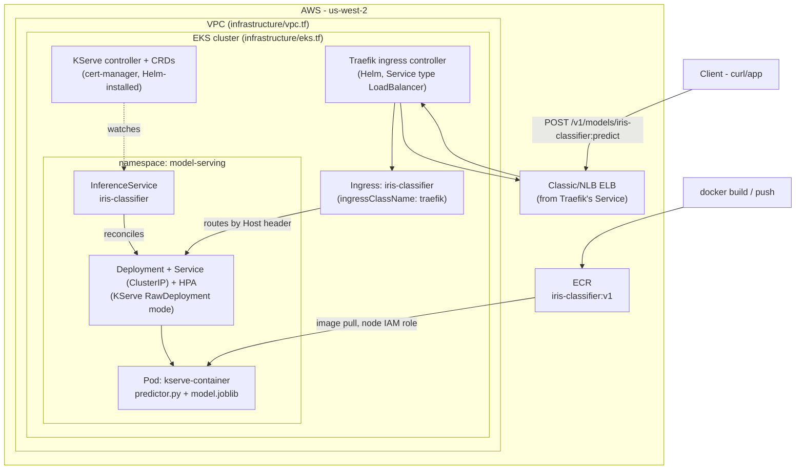

# KServe model deployment

Deploys a model on Amazon EKS using [KServe](https://kserve.github.io/website/), on top of the
sandbox EKS cluster provisioned in [`infrastructure/`](./infrastructure).

## Architecture



**Why RawDeployment mode:** the sandbox cluster is small on purpose (public subnets only,
`t3.medium` nodes, capped at 9 EC2 instances — see `infrastructure/variables.tf`). Knative +
Istio (KServe's default "Serverless" mode) adds a control plane most sandbox clusters don't have
headroom for. `serving.kserve.io/deploymentMode: RawDeployment` makes KServe manage a plain
Deployment/Service/HPA instead, at a fraction of the resource cost — the trade-off is no
scale-to-zero and no Knative revisions. Because RawDeployment's predictor Service is a plain
`ClusterIP`, it also needs something to expose it — this repo uses **Traefik** as the ingress
controller rather than the Istio Gateway that Serverless mode would otherwise provide.

## Repo layout

```
infrastructure/   Terraform: VPC, EKS cluster, node group, IAM (already in this repo)
model/            Model training code, KServe predictor, Dockerfile
k8s/               Namespace, InferenceService, and Traefik Ingress manifests
```

## 1. Provision the cluster

```bash
cd infrastructure
terraform init
terraform apply
aws eks update-kubeconfig --region us-west-2 --name sandbox-eks
```

## 2. Install KServe (RawDeployment mode, no Knative/Istio)

```bash
# cert-manager (KServe's webhook needs it)
kubectl apply -f https://github.com/cert-manager/cert-manager/releases/latest/download/cert-manager.yaml
kubectl wait --for=condition=Available -n cert-manager deployment --all --timeout=180s

# KServe CRDs + controller — installed into their own namespace explicitly,
# rather than whatever namespace your kubeconfig happens to be pointed at
helm install kserve-crd oci://ghcr.io/kserve/charts/kserve-crd \
  --version v0.13.1 \
  --namespace kserve --create-namespace

helm install kserve oci://ghcr.io/kserve/charts/kserve \
  --version v0.13.1 \
  --namespace kserve \
  --set kserve.controller.deploymentMode=RawDeployment \
  --set kserve.controller.rbacProxyImage=quay.io/brancz/kube-rbac-proxy:v0.18.0

# Wait for the controller to actually be serving before anything else in this
# namespace touches its webhook (the chart's own ClusterServingRuntime objects
# are validated by it, so an early apply can race a not-yet-Ready pod)
kubectl wait --for=condition=Available -n kserve deployment/kserve-controller-manager --timeout=180s
```

> `kserve.controller.rbacProxyImage` overrides the `kube-rbac-proxy` sidecar image — the chart's
> pinned default for `v0.13.1` is `gcr.io/kubebuilder/kube-rbac-proxy:v0.13.1`, which Kubebuilder
> pulled from public availability in 2025. Without this override the `kserve-controller-manager`
> pod sits at `1/2 Ready` with that sidecar in `ImagePullBackOff` forever, which then surfaces as
> the "no endpoints available" webhook error below since the pod never becomes fully Ready.

Both `helm install` commands above can fail on a **first run** with either of these — both are
one-time startup races, not config errors:

> **`unable to parse bytes as PEM block` / `unable to load root certificates`**
> cert-manager's `cainjector` needs a few seconds to patch the CA bundle into KServe's webhook
> configs before the API server can call them.

> **`no endpoints available for service kserve-webhook-server-service`**
> the `kserve-controller-manager` pod isn't Ready yet, so the chart's own webhook-validated
> resources (like `ClusterServingRuntime`s) can't apply. If it stays this way indefinitely rather
> than resolving in a few seconds, check `kubectl get pods -n kserve` — a `1/2 Ready` pod usually
> means the `rbacProxyImage` issue above, not a timing race.

> **`exists and cannot be imported into the current release: invalid ownership metadata... current value is "default"`**
> a *previous* failed install (e.g. into the wrong namespace) already created some of KServe's
> **cluster-scoped** resources — CRDs, `ClusterRole`s/`ClusterRoleBinding`s, and the webhook
> configs are all cluster-scoped, so `helm uninstall` in any one namespace doesn't remove them,
> and Helm refuses to "adopt" resources owned by a different release namespace. You may hit this
> error for one kind of resource at a time as each install step reaches it. Rather than fixing
> them one by one, clean up everything cluster-scoped in one pass (safe if you don't have real
> `InferenceService` resources running yet — check `kubectl get inferenceservices -A` first if
> unsure). Filter by the Helm ownership annotation rather than by name — the chart also bundles
> ModelMesh's RBAC (e.g. `modelmesh-controller-role`), which won't match a `grep kserve`. Needs
> `jq` (`brew install jq` if you don't have it):
> ```bash
> kubectl get crd -o name | grep 'serving.kserve.io' | xargs -r kubectl delete
>
> for kind in clusterrole clusterrolebinding validatingwebhookconfiguration mutatingwebhookconfiguration; do
>   kubectl get $kind -o json \
>     | jq -r '.items[] | select(.metadata.annotations["meta.helm.sh/release-name"]=="kserve") | .metadata.name' \
>     | xargs -r kubectl delete $kind
> done
> ```
> then retry `helm install kserve-crd` followed by `helm install kserve` from scratch.

**If either of the first two happens, don't just rerun the same command** — a failed
`helm install` (without
`--atomic`) leaves the release recorded as `failed`/`pending-install`, and Helm will refuse to
reuse that name (`cannot reuse a name that is still in use`) or `helm upgrade` will keep
retrying against a half-applied release. Clean up, **reinstall**, and only reach for the CA-wait
loop if the PEM error specifically comes back:

```bash
helm uninstall kserve -n kserve --ignore-not-found
helm uninstall kserve-crd -n kserve --ignore-not-found

# reinstall — this is the same block from step 2 above
helm install kserve-crd oci://ghcr.io/kserve/charts/kserve-crd \
  --version v0.13.1 \
  --namespace kserve --create-namespace
helm install kserve oci://ghcr.io/kserve/charts/kserve \
  --version v0.13.1 \
  --namespace kserve \
  --set kserve.controller.deploymentMode=RawDeployment \
  --set kserve.controller.rbacProxyImage=quay.io/brancz/kube-rbac-proxy:v0.18.0
```

If — and only if — that second `helm install` fails again with the PEM/root-certificates error,
one or more webhook configs exist but their CA bundles haven't been injected yet. The chart
creates webhooks under **both** `kserve-webhook-server` and `modelmesh-webhook-server`, so check
across all of them rather than a single hardcoded name (needs `jq`; `brew install jq` if you
don't have it):

```bash
for i in $(seq 1 24); do
  empty=$(kubectl get validatingwebhookconfigurations -o json \
    | jq -r '.items[] | select(.metadata.name | test("kserve|modelmesh")) | .webhooks[] | select(.clientConfig.caBundle == null or .clientConfig.caBundle == "") | .name')
  if [ -z "$empty" ]; then
    echo "all CA bundles populated"; break
  fi
  echo "still waiting on: $empty ($i/24)"; sleep 5
done

helm upgrade --install kserve oci://ghcr.io/kserve/charts/kserve \
  --version v0.13.1 \
  --namespace kserve \
  --set kserve.controller.deploymentMode=RawDeployment \
  --set kserve.controller.rbacProxyImage=quay.io/brancz/kube-rbac-proxy:v0.18.0

kubectl wait --for=condition=Available -n kserve deployment/kserve-controller-manager --timeout=180s
```

## 3. Install Traefik

```bash
helm repo add traefik https://traefik.github.io/charts
helm repo update
helm install traefik traefik/traefik \
  --namespace traefik --create-namespace \
  --set service.type=LoadBalancer
```

Wait for the ELB to be provisioned and note its hostname — you'll use it as the `Host` for
routing, since there's no real domain set up in the sandbox:

```bash
kubectl get svc -n traefik traefik \
  -o jsonpath='{.status.loadBalancer.ingress[0].hostname}'
```

## 4. Build and push the model image

```bash
cd model
aws ecr create-repository --repository-name iris-classifier --region us-west-2
aws ecr get-login-password --region us-west-2 | \
  docker login --username AWS --password-stdin <ACCOUNT_ID>.dkr.ecr.us-west-2.amazonaws.com

docker build -t <ACCOUNT_ID>.dkr.ecr.us-west-2.amazonaws.com/iris-classifier:v1 .
docker build --platform linux/amd64 -t <ACCOUNT_ID>.dkr.ecr.us-west-2.amazonaws.com/iris-classifier:v1 .
docker push <ACCOUNT_ID>.dkr.ecr.us-west-2.amazonaws.com/iris-classifier:v1
```

The training step (`train.py`) runs inside the Docker build, so the image ships with
`model.joblib` baked in — no S3 bucket or PVC needed for this demo. Swap that step for
`COPY model.joblib /mnt/models/model.joblib` once you have a real training pipeline.

## 5. Deploy

Edit the `image:` field in `k8s/inferenceservice.yaml` with your account ID and region. In
`k8s/ingress.yaml`, replace `<TRAEFIK_LB_HOSTNAME_DASHED_IP>` with the ELB hostname/IP from step
3, dashes instead of dots (e.g. an ELB at `52.10.1.2` becomes `iris.52-10-1-2.nip.io`) — this
gives you a working DNS name for free via [nip.io](https://nip.io), no real domain needed. Then:

```bash
kubectl apply -f k8s/namespace.yaml
kubectl apply -f k8s/inferenceservice.yaml
kubectl apply -f k8s/ingress.yaml
kubectl get inferenceservice -n model-serving iris-classifier -w
```

## 6. Call it

```bash
curl -X POST http://iris.<dashed-ip>.nip.io/v1/models/iris-classifier:predict \
  -H "Content-Type: application/json" \
  -d @k8s/sample-input.json
```

Expected response shape:
```json
{"predictions": [0, 2], "probabilities": [[...], [...]]}
```

For local testing without waiting on DNS/ELB propagation, `kubectl -n model-serving
port-forward svc/iris-classifier-predictor 8080:80` and hit `localhost:8080` still works as a
fallback — it just bypasses Traefik.

## Resource footprint

The predictor container requests `250m CPU / 256Mi` and limits at `500m CPU / 512Mi` —
sized to leave room for `kube-system` and the KServe controller alongside it on a
`t3.medium` (2 vCPU / 4 GiB) node, per `infrastructure/variables.tf`.
